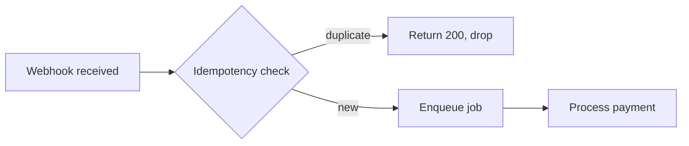
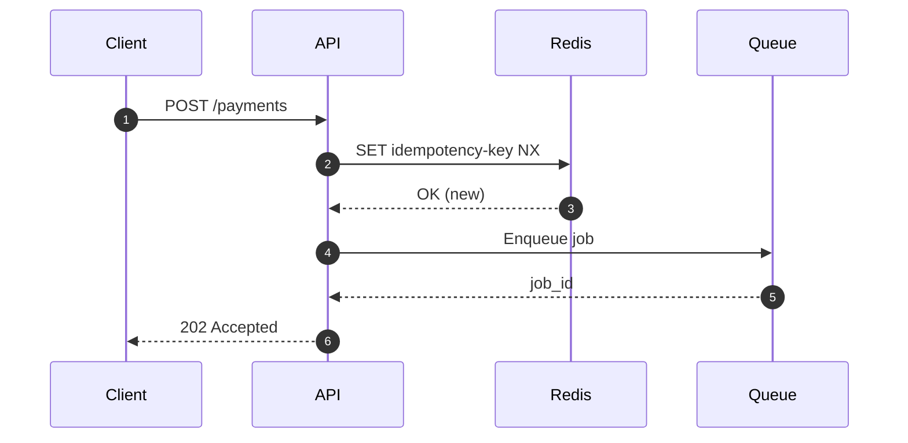
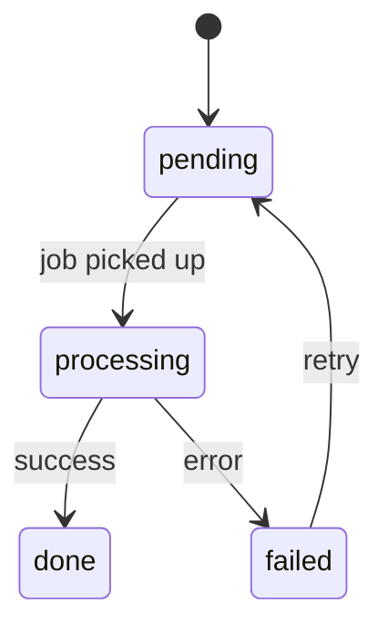

# Vault Guide: agents/

This Obsidian vault is used to run **projects** — units of focused work that can
span multiple Linear tickets and gather investigations, agent plans, decisions,
and documents in one place.

---

## Folder structure

```
agents/
  AGENTS.md              # this guide
  CLAUDE.md              # @AGENTS.md
  projects/
    YYYY-MM-<slug>/      # one folder per project
      project.md         # overview + master frontmatter
      investigations/    # research notes, explorations, findings
      plans/             # plans handed to / produced by agents
      decisions/         # decisions made during the project
      documents/         # images, PDFs, human input, references
  templates/             # note templates — copy and rename when creating notes
    project.md
    investigation.md
    plan.md
    decision.md
  _archive/              # completed projects (same internal layout)
  scripts/
    new-project.sh       # scaffolds a new project folder
```

---

## File naming

**Never use generic names like `investigation.md` or `decision.md`.** The folder
already conveys the type. The filename must call out the **subject** of the note.

Use descriptive, kebab-case names:

```
investigations/payments-retry-race-condition.md
investigations/webhook-latency-root-cause.md
plans/migrate-webhook-handlers-to-queue.md
decisions/use-redis-for-idempotency-keys.md
decisions/drop-polling-in-favour-of-webhooks.md
documents/payment-flow-diagram.png
documents/stakeholder-brief-2026-05.pdf
```

---

## File metadata (YAML frontmatter)

Every note starts with a frontmatter block. Obsidian renders these as
Properties and makes them filterable/queryable.

### Base fields (all note types)

```yaml
---
title: "Human-readable title"
type: project | investigation | plan | decision | document
status: <see per-type below>
created: YYYY-MM-DD
updated: YYYY-MM-DD
tags: []
tickets: []           # Linear ticket IDs, e.g. [FIN-123, FIN-124]
related: []           # wikilinks to other notes, e.g. ["[[use-redis-for-idempotency-keys]]"]
---
```

### Per-type additions

**project.md**
```yaml
owner: <name or @handle>
repos: []             # repo names present in ~/repositories, e.g. [api, frontend]
linear_project: ""    # Linear project URL or ID
status: active | paused | done | archived
```

**plan.md**
```yaml
agent: ""             # agent/model that will execute or produced this plan
status: draft | approved | executing | done
```

**decision.md**
```yaml
decided_on: YYYY-MM-DD
supersedes: ""        # wikilink to prior decision this replaces, if any
superseded_by: ""     # wikilink to newer decision, if this is no longer active
```

### `decisions/` — what goes here

Any decision taken **while performing a task**: a tool choice, an architecture
call, a tradeoff accepted, a scope change. The goal is that a future agent or
human can read this folder and understand *why* things are the way they are.

Keep them lightweight: a short Context, the Decision, and Why. One decision per
file (or one file for tightly related decisions on the same day).

---

## Connecting notes in Obsidian

### Internal links

| Syntax | Renders as |
|---|---|
| `[[note-name]]` | Link to a note by filename (no extension) |
| `[[note-name#Heading]]` | Link to a specific heading in a note |
| `[[note-name\|label]]` | Link with a custom display label |

Always use the descriptive filename (e.g. `[[use-redis-for-idempotency-keys]]`),
not a generic one. Obsidian resolves vault-wide by filename; no path needed
unless two notes share a name.

### Transclusion / embedding

| Syntax | Effect |
|---|---|
| `![[note-name]]` | Embed the full note inline |
| `![[note-name#Heading]]` | Embed a single section |
| `![[diagram.png]]` | Embed an image from `documents/` |
| `![[brief.pdf]]` | Embed a PDF viewer |

### Frontmatter `related`

Populate `related` with wikilinks to the most important connected notes. This
feeds Obsidian's backlinks panel and graph view:

```yaml
related:
  - "[[payments-retry-race-condition]]"
  - "[[use-redis-for-idempotency-keys]]"
```

### Ticket cross-referencing

Tag every note that touches a Linear ticket with the ticket ID in `tickets:`.
This lets you filter all notes for a ticket via Obsidian search:
`[tickets: FIN-123]`.

---

## Mermaid diagrams

Use fenced `mermaid` blocks in any note to draw flows, sequences, and state
diagrams. Obsidian renders them natively — no plugin required.

**Flowchart example:**


**Sequence diagram example:**


**State diagram example:**


Prefer diagrams in `investigations/` and `plans/` whenever a flow is easier to
understand visually than in prose.

---

## Workflow

### Starting a project

```bash
bash ~/repositories/agents/scripts/new-project.sh <slug> \
  [--tickets FIN-1,FIN-2] \
  [--linear https://linear.app/...]
```

This creates `projects/YYYY-MM-<slug>/` with all subfolders and a pre-filled
`project.md`. Add notes as work progresses — copy from `templates/` and give
them descriptive names.

### During a project

- Add notes to the right subfolder as work happens.
- Keep `project.md` updated — especially `status`, `tickets`, and `repos`.
- Log decisions as they are made (even small ones). Future context matters.
- Embed or link supporting documents from `documents/`.

### Closing a project

1. Set `status: archived` in `project.md` frontmatter.
2. Move the whole project folder to `_archive/`:
   ```bash
   mv projects/YYYY-MM-<slug> _archive/
   ```
3. The internal structure stays intact — archived projects are still searchable.
