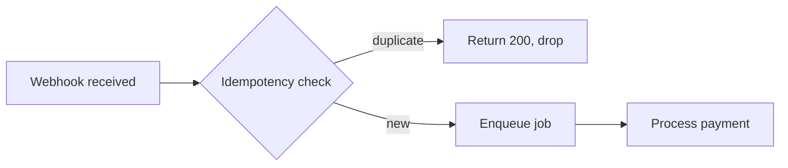
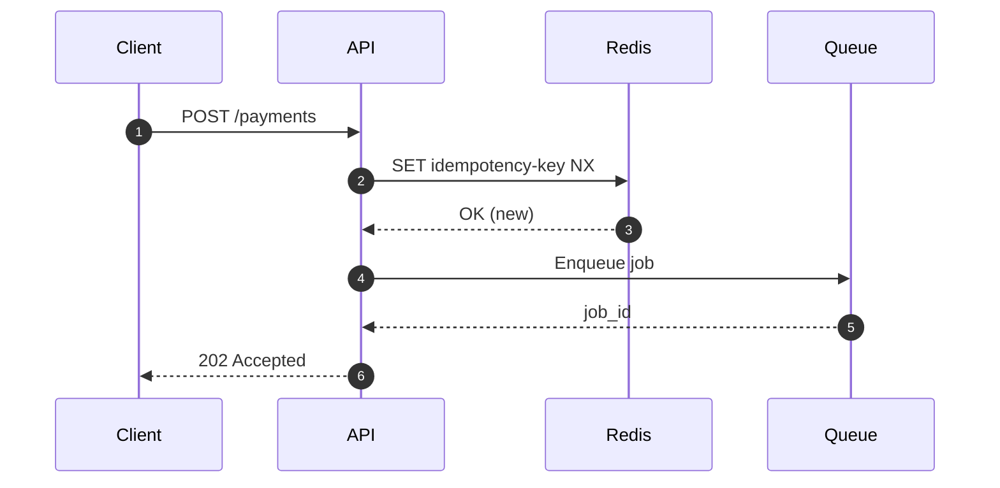
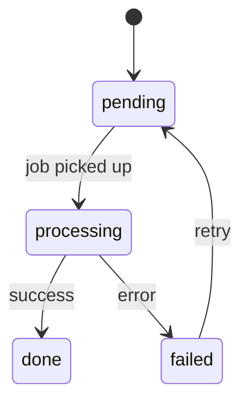

# Vault Guide: agents/

This Obsidian vault is used to run **projects** — units of focused work that can
span multiple Linear tickets and gather investigations, agent plans, decisions,
and documents in one place.

---

## Language rule (critical)

**All vault content must be written in English** — note bodies, titles,
frontmatter values, investigations, plans, decisions, and document prose. This
is a local knowledge base, not GitHub-facing content, so the Spanish rule for
commits/PRs/issues does **not** apply here. Keep everything in English for
consistency and searchability.

---

## Prose formatting (no hard wrapping)

Prose is **not** hard-wrapped — one line per paragraph/bullet, blank line between. This follows the global *Markdown Prose Formatting* rule; the vault is **no exception** to it. (Tables, fenced code, and Mermaid blocks are naturally multi-line — unaffected.)

---

## Folder structure

```
agents/
  AGENTS.md              # this guide
  CLAUDE.md              # @AGENTS.md
  projects/
    YYYY-MM-<slug>/      # one folder per project
      <slug>_project.md  # overview + master frontmatter (e.g. mcp-movements_project.md)
      investigations/    # research notes, explorations, findings
      plans/             # plans handed to / produced by agents
      decisions/         # decisions made during the project
      documents/         # images, PDFs, human input, references
  templates/             # note templates — copy and rename when creating notes
    project.md           # scaffolded by new-project.sh as <slug>_project.md
    investigation.md
    plan.md
    decision.md
  _archive/              # completed projects (same internal layout)
  scripts/
    new-project.sh       # scaffolds a new project folder
    archive.sh           # archives finished project(s) into _archive/
```

---

## File naming

**Never use generic names like `investigation.md` or `decision.md`.** The folder
already conveys the type. The filename must call out the **subject** of the note.

The project overview note is no exception: name it **`<slug>_project.md`** —
the project's folder slug (the `YYYY-MM-` prefix dropped) followed by the
`_project.md` suffix, e.g. `mcp-movements_project.md`. `new-project.sh`
creates it with this name; one per folder, unique vault-wide.

Use descriptive, kebab-case names:

```
investigations/payments-retry-race-condition.md
investigations/webhook-latency-root-cause.md
plans/migrate-webhook-handlers-to-queue.md
decisions/use-redis-for-idempotency-keys.md
decisions/drop-polling-in-favour-of-webhooks.md
documents/payment-flow-diagram.png
documents/stakeholder-brief-2026-05.pdf
```

---

## File metadata (YAML frontmatter)

Every note starts with a frontmatter block. Obsidian renders these as
Properties and makes them filterable/queryable.

### Base fields (all note types)

```yaml
---
title: "Human-readable title"
type: project | investigation | plan | decision | document
status: <see per-type below>
created: YYYY-MM-DD
updated: YYYY-MM-DD
tags: []
tickets: []           # Linear ticket IDs, e.g. [FIN-123, FIN-124]
related: []           # wikilinks to other notes, e.g. ["[[use-redis-for-idempotency-keys]]"]
---
```

### Per-type additions

**`<slug>_project.md`** (the project overview)
```yaml
owner: <name or @handle>
repos: []             # repo names present in ~/repositories, e.g. [api, frontend]
linear_project: ""    # Linear project URL or ID
status: active | paused | done | archived
```

**plan.md**
```yaml
agent: ""             # agent/model that will execute or produced this plan
status: draft | approved | executing | done
```

**decision.md**
```yaml
decided_on: YYYY-MM-DD
supersedes: ""        # wikilink to prior decision this replaces, if any
superseded_by: ""     # wikilink to newer decision, if this is no longer active
```

### `decisions/` — what goes here

Any decision taken **while performing a task**: a tool choice, an architecture
call, a tradeoff accepted, a scope change. The goal is that a future agent or
human can read this folder and understand *why* things are the way they are.

Keep them lightweight: a short Context, the Decision, and Why. One decision per
file (or one file for tightly related decisions on the same day).

---

## Connecting notes in Obsidian

### Internal links

| Syntax | Renders as |
|---|---|
| `[[note-name]]` | Link to a note by filename (no extension) |
| `[[note-name#Heading]]` | Link to a specific heading in a note |
| `[[#Heading]]` | Link to a heading **in the same note** (no filename) |
| `[[note-name\|label]]` | Link with a custom display label |
| `[[#Heading\|label]]` | Same-note heading link with a custom label |

Always use the descriptive filename (e.g. `[[use-redis-for-idempotency-keys]]`),
not a generic one. Obsidian resolves vault-wide by filename; no path needed
unless two notes share a name. Project overviews are uniquely named per the
`<slug>_project.md` convention, so link them by bare filename:
`[[mcp-engine-deep-dive_project|label]]`. When two notes genuinely **do** share
a name, disambiguate with a vault-relative path:
`[[projects/2026-06-foo/note|label]]` — a bare `[[note]]` silently resolves to
the wrong one.

### Never link to memory files

**Wikilinks must point only at notes inside this vault.** Do **not** `[[link]]`
to agent memory files (the `~/.claude/.../memory/*.md` store — e.g.
`[[user-preferences]]`, `[[project-payment-flows]]`). Memory lives
outside the vault, so Obsidian can never resolve those links — they render as
permanently broken. If you want to surface a fact that lives in memory, **write
it into the note as prose** (and cite the source if useful), or link to a real
vault note that covers it. The same applies to `related:` frontmatter — list only
in-vault notes there.

### Intra-document links — gotchas (don't write GitHub-style anchors)

For jump links **within the same note** (e.g. a TL;DR pointing at a later
section), use the Obsidian wikilink form `[[#Heading]]`, **not** the
GitHub/Markdown anchor form `[label](#slugified-heading)`. Two reasons these
bite:

- **No slugs.** Obsidian resolves `#` links by the **exact heading text**, not a
  lowercased-hyphenated slug. `[Slack history](#slack-history-bug-class)` is a
  dead link; `[[#Slack history (bug class is recurring)|Slack history]]` works.
  Copy the heading verbatim (parentheses and all) after the `#`.
- **Escape the pipe inside tables.** A `|` is a table column separator, so the
  alias pipe in a wikilink placed in a table cell must be escaped as `\|`:
  `[[#Which callers actually hit the bug\|caller nuance]]`. Unescaped, it splits
  the cell and breaks the table. (Outside tables, a plain `|` is fine.)

### Transclusion / embedding

| Syntax | Effect |
|---|---|
| `![[note-name]]` | Embed the full note inline |
| `![[note-name#Heading]]` | Embed a single section |
| `![[diagram.png]]` | Embed an image from `documents/` |
| `![[brief.pdf]]` | Embed a PDF viewer |

### Frontmatter `related`

Populate `related` with wikilinks to the most important connected notes. This
feeds Obsidian's backlinks panel and graph view:

```yaml
related:
  - "[[payments-retry-race-condition]]"
  - "[[use-redis-for-idempotency-keys]]"
```

### Ticket cross-referencing

Tag every note that touches a Linear ticket with the ticket ID in `tickets:`.
This lets you filter all notes for a ticket via Obsidian search:
`[tickets: FIN-123]`.

---

## Mermaid diagrams

Use fenced `mermaid` blocks in any note to draw flows, sequences, and state
diagrams. Obsidian renders them natively — no plugin required.

**Flowchart example:**


**Sequence diagram example:**


**State diagram example:**


Prefer diagrams in `investigations/` and `plans/` whenever a flow is easier to
understand visually than in prose.

---

## Workflow

### Starting a project

```bash
bash ~/repositories/agents/scripts/new-project.sh <slug> \
  [--tickets FIN-1,FIN-2] \
  [--linear https://linear.app/...]
```

This creates `projects/YYYY-MM-<slug>/` with all subfolders and a pre-filled
`<slug>_project.md`. Add notes as work progresses — copy from `templates/` and
give them descriptive names.

### During a project

- Add notes to the right subfolder as work happens.
- Keep the `<slug>_project.md` overview updated — especially `status`, `tickets`, and `repos`.
- Log decisions as they are made (even small ones). Future context matters.
- Embed or link supporting documents from `documents/`.

### Closing a project

Use the script — it sets `status: archived` (and bumps `updated:` to today) in each
project's `<slug>_project.md`, then moves the whole folder into `_archive/`. The
internal structure stays intact, so archived projects are still searchable.

```bash
bash ~/repositories/agents/scripts/archive.sh <project> [<project> ...]
```

- `<project>` is a folder name or any **unique substring** of it (the `YYYY-MM-`
  prefix is optional), so
  `archive.sh my-feature 2026-07-another-project` works.
- Add `--dry-run` to preview the resolved folders without moving anything.
- It resolves all names first and **fails before moving anything** if a name is
  ambiguous or unmatched, or if a folder of the same name already exists in
  `_archive/` (it won't overwrite).

Only the first-frontmatter `status:`/`updated:` lines are rewritten — a `status:`
mention in the body is left alone. (Manual fallback, if ever needed: edit
`status: archived` in the `<slug>_project.md`, then `mv projects/YYYY-MM-<slug> _archive/`.)
